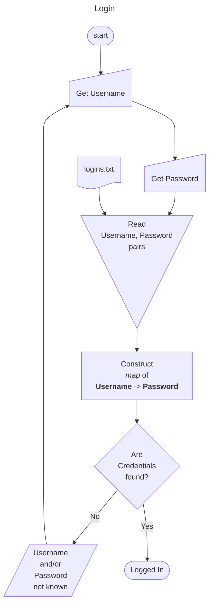

# Dice Game: Login

```mermaid
---
title: Login
---
flowchart TD

    start@{ shape: stadium }

    input_name[/Get Username/]@{shape: manual-input}

    input_password[/Get Password/]@{shape: manual-input}

    read_logins{"Read
        Username, Password
        pairs
    "}@{shape: manual-file}

    map_logins{"`
        Construct
        _map_ of
        **Username** -> **Password**
    `"}@{ shape: rect}

    logins_txt{"logins.txt"}@{shape: doc}

    check_credentials{"
        Are
        Credentials
        found?
    "}

    bad_credentials{"
        Username
        and/or 
        Password
        not known
    "}@{ shape: lean-r }

    logged_in@{ shape: stadium, label: "Logged In" }

    start --> input_name
    input_name ---> input_password --> read_logins --> map_logins --> check_credentials
    logins_txt --> read_logins
    check_credentials -- "No" --> bad_credentials --> input_name
    check_credentials -- "Yes" --> logged_in
```
