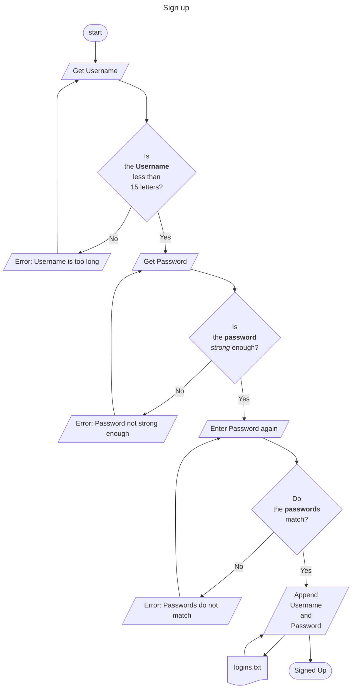

# Dice Game: Sign Up

```mermaid
---
title: Sign up
---
flowchart TD

    start@{ shape: stadium }

    input_name[/Get Username/]

    check_name{"`Is
        the **Username**
        less than
        15 letters?
    `"}

    username_too_long[/Error: Username is too long/]
    
    input_password[/Get Password/]

    check_password{"`Is
        the **password**
        _strong_ enough?
    `"}

    password_too_weak[/Error: Password not strong enough/]

    confirm_password[/Enter Password again/]

    check_passwords{"`Do
        the **password**s
        match?
    `"}

    passwords_do_not_match[/Error: Passwords do not match/]

    write_details[/Append
        Username
        and
        Password
    /]

    logins_txt{"logins.txt"}@{shape: doc}

    signed_up@{ shape: stadium, label: "Signed Up" }

    start --> input_name

    input_name ---> check_name
    check_name -- "No" --> username_too_long --> input_name
    check_name -- "Yes" --> input_password
    
    input_password --> check_password
    check_password -- "No" --> password_too_weak --> input_password
    check_password -- "Yes" --> confirm_password
    
    confirm_password --> check_passwords
    check_passwords -- "No" --> passwords_do_not_match --> confirm_password
    check_passwords -- "Yes" --> write_details

    write_details --> logins_txt
    logins_txt --> write_details
    write_details --> signed_up
```
